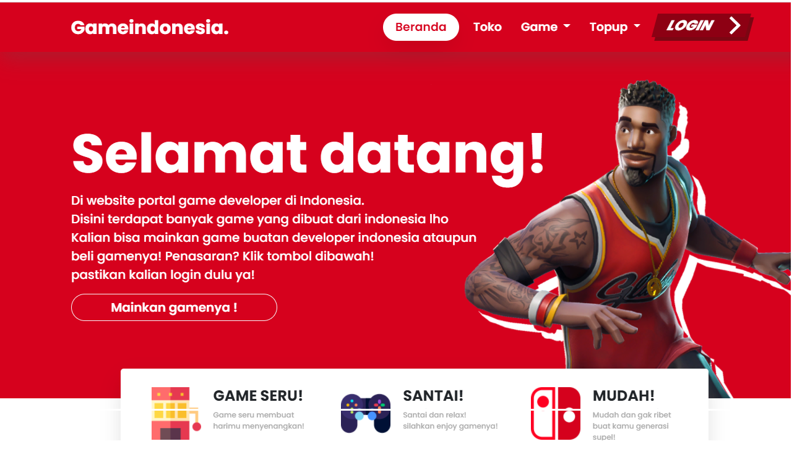

# Penjelasan Tampilan UX
Pada perancangan halaman web interface **Home**, kami menampilkan beberapa informasi.

Pada halaman **Home** diberikan penjelasan bahwa web kami berperan sebagai portal atau gerbang dalam penampungan game development. Yang artinya bahwa nantinya setiap developer game dapat meng-upload file hasil karya developer berupa game yang nantinya bisa diperkenalkan melalui website kami. 

Dengan fitur pengguna web kami dapat memainkan game tersebut secara langsung. Kami menyediakan fitur menu toko game, artinya user dapat membeli game pada website kami jika developer tidak berkenan untuk dipublikasikan secara gratis. Selain itu user juga dapat memainkan game secara langsung pada menu game.

Untuk menu Top-Up ini merupakan rencana dari kelompok kami untuk menyediakan layanan top-up seperti diamon mobile legend yang terhubung melalui Dana atau layanan transaksi online lainnya.

